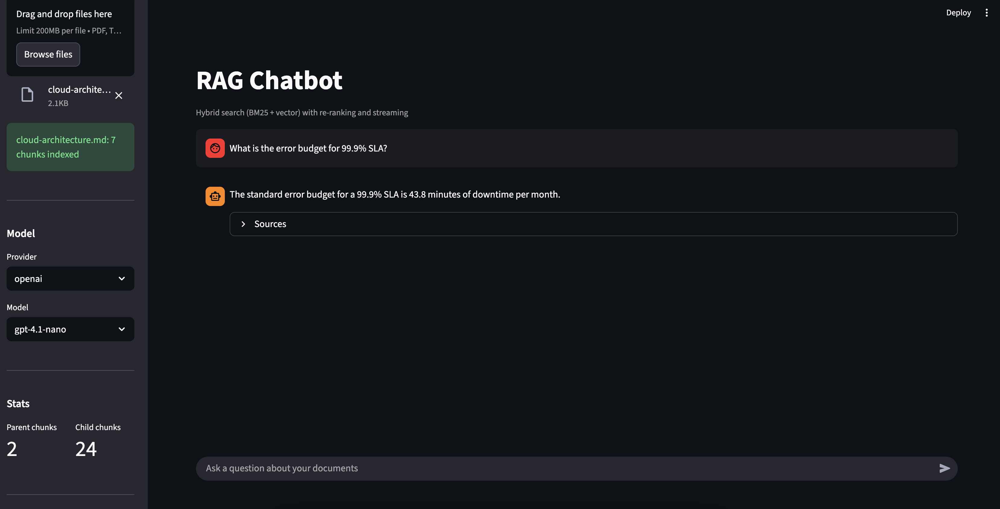

# RAG Chatbot

RAG pipeline with hybrid search, LLM re-ranking, and streaming responses. Upload PDF, TXT, or Markdown documents and query them via REST API or web interface. The FastAPI backend works independently from the Streamlit UI — designed for integration into existing systems.



## Architecture

```
Documents (PDF/TXT/MD)
        |
        v
  Parent-Child Chunking
  (parent: 2000 chars, child: 400 chars)
        |
        v
  Local Embeddings (all-MiniLM-L6-v2)
        |
        v
  ChromaDB (vector) + BM25 (lexical)
        |
  User Question
        |
        +---> Query Reformulation (multi-turn context)
        |
        +---> Vector Search (cosine similarity)
        +---> BM25 Search (lexical matching)
        |
        v
  Reciprocal Rank Fusion (RRF)
        |
        v
  LLM Re-ranking (relevance scoring)
        |
        v
  Parent chunk retrieval (full context)
        |
        v
  LLM Answer Generation (streaming via SSE)
        |
        v
  Answer + Sources
```

## Highlights

- **Hybrid search** — BM25 (lexical) + vector (semantic) with Reciprocal Rank Fusion
- **LLM re-ranking** — relevance scoring of retrieved chunks before answer generation
- **Parent-child chunking** — small chunks for precise retrieval, large chunks for rich LLM context
- **Streaming** — Server-Sent Events for real-time token-by-token response
- **Multi-turn** — query reformulation using conversation history
- **Chat history** — SQLite-backed persistent chat sessions
- **Multi-provider** — switch between Groq (free) and OpenAI from the UI
- **Local embeddings** — all-MiniLM-L6-v2 via ONNX, no external API needed
- **No framework overhead** — vanilla Python + direct API calls, no LangChain

## Tech Stack

| Component | Technology |
|-----------|-----------|
| LLM | Groq (Llama 3.3 70B) / OpenAI (GPT-4.1) |
| Embeddings | all-MiniLM-L6-v2 (local, ONNX) |
| Vector DB | ChromaDB |
| Lexical search | BM25 (rank-bm25) |
| API | FastAPI + SSE streaming |
| UI | Streamlit |
| Chat storage | SQLite |
| Container | Docker |

## Quick Start

### With Docker

```bash
cp .env.example .env
# Add your API keys to .env (Groq is free, OpenAI is optional)

docker compose up --build
```

### Without Docker

```bash
python3 -m venv venv
source venv/bin/activate
pip install -r requirements.txt

cp .env.example .env
# Add your API keys to .env (Groq is free, OpenAI is optional)

# Terminal 1 — API
uvicorn app.main:app --host 0.0.0.0 --port 8000

# Terminal 2 — UI
streamlit run app/ui.py --server.port 8501 --server.headless true
```

Open http://localhost:8501

## API

| Method | Endpoint | Description |
|--------|----------|-------------|
| POST | `/ingest` | Upload and index a document (PDF/TXT/MD) |
| POST | `/query` | Ask a question (supports SSE streaming) |
| GET | `/providers` | List available LLM providers and models |
| POST | `/model` | Switch LLM provider/model at runtime |
| GET | `/stats` | Chunk counts |
| GET | `/health` | Health check |

### Examples

```bash
# Upload a document
curl -X POST http://localhost:8000/ingest -F "file=@document.pdf"

# Ask a question
curl -X POST http://localhost:8000/query \
  -H "Content-Type: application/json" \
  -d '{"question": "What is the main topic?", "stream": false}'

# Switch model
curl -X POST http://localhost:8000/model \
  -H "Content-Type: application/json" \
  -d '{"provider": "groq", "model": "llama-3.1-8b-instant"}'
```

## Project Structure

```
rag-chatbot/
├── app/
│   ├── main.py            # FastAPI endpoints
│   ├── rag.py             # RAG pipeline (ingest, search, query)
│   ├── chat_history.py    # SQLite chat persistence
│   ├── config.py          # Configuration and provider settings
│   └── ui.py              # Streamlit web interface
├── documents/             # Uploaded documents (gitignored)
├── requirements.txt
├── Dockerfile
├── docker-compose.yml
├── .env.example
└── README.md
```
